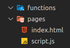
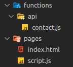

# Contact Form on Pages with Functions

This blog post will go over a few things:
* What is Pages
* What are functions
* How to make a contact form
* Testing & Deploying

If you are already in know about Pages and Functions then you can [click here](#How-to-make-a-contact-form) to skip over the introduction

## What is Pages?
Cloudflare Pages is a product for you to host static websites easily and for free (500 builds/month free plan - no bandwidth limits!). If you have a Jamstack (JavaScipt, API and Markup) website then this is the perfect service for you.

Now, you may be asking, why Pages over [Netlify](https://www.netlify.com/), [GitHub Pages](https://pages.github.com/) or another service? Well, I'm glad you asked! Cloudflare has a network of over 250 datacenters all around the world and all of them can serve _your_ website ([Network Map](https://cloudflare.com/network)). This means that your website is within 50ms of 95% of the globe 🤯. If you're like me and you're a performance nut, that is pretty god damn awesome.

Alongside their network you also get the other benefits of Cloudflare, security, reliability and of course even more performance improvements.

## What are functions?
Functions are a way to run serverless code in front of your Pages project. If you know about [Workers](https://workers.dev), Functions are the same but built right into Pages. Some use cases of functions are:
* Fetch data from an API
* Adding contact forms (hey, that's this blog!)
* Adding payments
* A/B testing
* Dynamic [OpenGraph](https://ogp.me/) tags
* Pulling data from a database (or even Airtable)
* Comment system

And a lot, lot more.

## How to make a contact form

### Making our form

Let's start with a simple contact form.
```html
<form method="post" action="/api/contact">
    <div>
        <label for="name">Name</label>
        <input name="name" required />
    </div>
    <div>
        <label for="message">Message</label>
        <textarea name="message" cols="50" rows="4" maxlength="2000" wrap="soft" required></textarea>
    </div>

     <div id="hcaptcha" class="h-captcha" data-sitekey="SITE_KEY" data-theme="dark"></div>

    <button type="submit">Send</button>
</form>
```

The main part of this form is the `method` and `action` attributes. These define _how_ we send this to our function. Since we're sending a `POST` to `/api/contact` it means that's where our function will be mapped to.

We're also protecting this form with [hCaptcha](https://hcaptcha.com/). This is a simple way to protect your website from spam. In our function we will validate that it's valid. Make sure you have a [site key](https://hcaptcha.com/signup) for your website.

(I have an example repository here if you want the full code: https://github.com/WalshyDev/pages-functions-contact)

### Making our function

Now that we have a form, we can make our function. To do this we will create a `functions` folder in the root of our project. Here is my project structure as an example:

<!--  -->


Now we have that directory, we want to make our function. Since we're mapping our function to `/api/contact` we want to create our function in the `/functions/api` folder and name it `contact.js`
> Fun fact: TypeScript works here too, just name it `contact.ts` if you want to use that

Routing is automatically done with any files created in the `functions` folder. So, if you made a file named `new.js` under `/functions/test` you would then be able to call `/test/new` in your website. For more info on this view here: <PAGES DOCS>

With that file created, this is how our directory structure looks like now:

<!--  -->


Writing code for a function is pretty simple however it is not the same as a Worker. In our case where we're utilizing routing (/functions/api) we need to export a _onRequest(Get|Post|Put|Delete)_ function. This function is called when a request with that method is made. For example, in our case, the client sends a `POST` request to `/api/contact` and the exported JS function is therefore called `onRequestPost`.

This means that our code setup looks like this:
```js
export async function onRequestPost(ctx) {
  try {
    return await handleRequest(ctx);
  } catch(e) {
    return new Response(`${e.message}\n${e.stack}`, { status: 500 }); 
  }
}

async function handleRequest({ request, env }) {
  // This is where our code will go :)
}
```

I am trying to make the Worker style here by creating a `handleRequest` with a [`request`](https://developer.mozilla.org/en-US/docs/Web/API/Request) and `env` parameter. I am also doing this to simply wrap all of our code in a try-catch. This is so that we can easily see and handle errors.

Now we have the basic layout, we need to actually handle the data which is being sent. To do this we need to parse the form data, we can do this with `request.formData` which will return a [`FormData`](https://developer.mozilla.org/en-US/docs/Web/API/FormData) object. From there, we can get our data and do a little validation handling on it like so:

```js
async function handleRequest({ request, env }) {
  const data = await request.formData();

  // Grab the form fields
  const name = data.get('name');
  const message = data.get('message');
  const captcha = data.get('h-captcha-response');

  // Validate the JSON
  if (!name || !message || !captcha) {
    return new Response('Make sure the fields are set!', { status: 400 });
  }
}
```

With the data we can now simply validate the captcha and send the message. The main part of this code is already done and this can now easily be deployed with Pages!

// Content of Worker

// Going through some of the code

// In action (gif?)

## Testing & Deploying
If you're not new to Pages then you will understand the trouble of testing this locally, well no more! [Pages CLI]() has now been released so you can easily test your website **and** your functions!

// Note about envs locally - Miniflare may pick up .env?? test